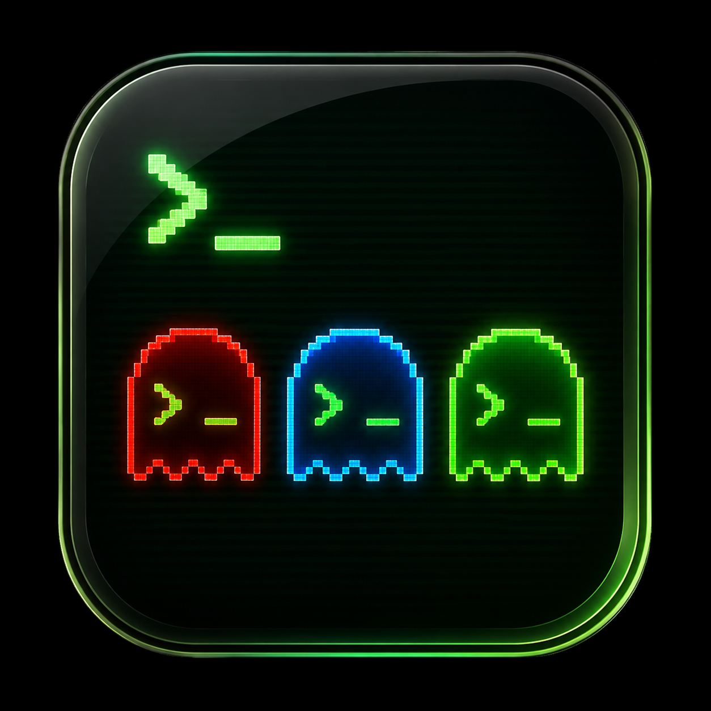
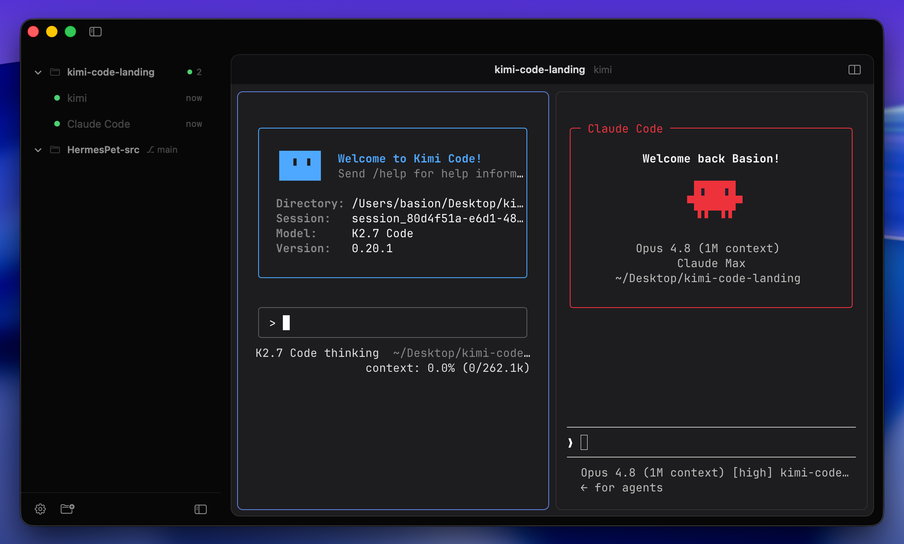
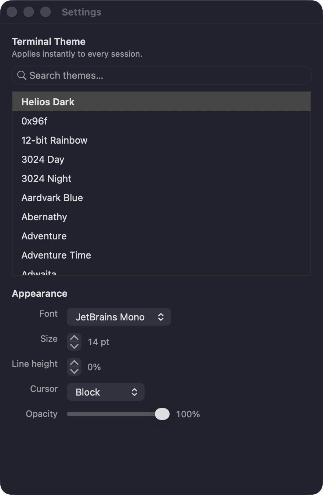
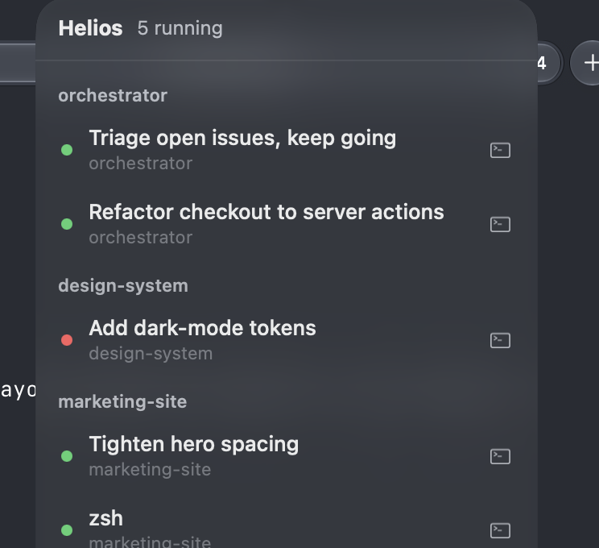

<div align="center">



# Helios

**专为运行 AI 编程 agent 打造的原生 macOS 终端。**
**会话比程序活得更久 · 是仪表盘而非标签栏 · 分屏 · 500+ 主题**

[](https://www.apple.com/macos/)
[](https://www.apple.com/mac/)
[](https://www.swift.org/)
[](https://github.com/basionwang-bot/helios/releases/latest)
[](https://github.com/basionwang-bot/helios/releases)
[](#-license)

🌍 [English](./README.md) · **简体中文**

### 🌐 [访问官网 →](https://basionwang-bot.github.io/helios/) · 📦 [下载 Helios.app →](https://github.com/basionwang-bot/helios/releases/latest)

解压、拖进应用程序、**右键 → 打开** · 不需要 Homebrew,不需要任何依赖



</div>

---

## 这是什么

在终端里跑一个 AI agent 很简单。但同时跑**五个** —— 分属不同项目、各在自己的分支上、有的还要循环跑一个小时 —— 普通终端就撑不住了:标签页一眼看不出状态,一次崩溃带走所有 agent,你最后是在看管窗口,而不是在干活。

**Helios 正是为这种工作流而生。** 你的 agent 跑在一个 launchd 托管的守护进程里 —— 在窗口**之外**。退出 Helios、让它崩溃、注销再登录、甚至重启电脑,它们都会回来。侧边栏像一块仪表盘,一个彩色圆点就告诉你哪个 agent 在忙、哪个干完了、哪个在等你。

> Swift 6 · AppKit · libghostty(GPU 渲染的终端内核)· 守护进程托管会话 · macOS 13+ · Apple Silicon · MIT

---

## ✨ 核心亮点

- **🛰 永不消失的会话。** 每个会话跑在后台守护进程里,而不是窗口里。退出、崩溃、重开 —— agent 照常运行。守护进程会把每段对话写到磁盘,下次启动时回放,所以即使被强杀或重启电脑,你的对话也会回来。

- **👀 是仪表盘,不是标签栏。** 每个项目和它里面每个 agent 的实时状态,用一个彩色圆点显示:**🟡 忙碌**、**🟢 完成**、**🔴 需要你回答**。

- **🔲 分屏。** 一个窗口里最多并排看四个会话(`⌘D`)。

- **📁 一个文件夹,一个项目。** 把项目文件夹加进来一次,它就常驻侧边栏 —— 带着 git 分支和"几个 agent 在跑"的汇总。

- **🌿 Worktree 会话。** 一步创建 git worktree **并**在其中开会话,多个 agent 在不同分支上操作同一个仓库而互不干扰。

- **🔌 Sessions MCP。** 内置的 Model Context Protocol 服务器让一个 agent 驱动另一个 —— 读它的输出、替它输入、甚至回答它的菜单。

- **⚡ 快捷预设 · 🔔 通知 · ⌘K 命令面板 · 🎨 500+ 实时主题。**

<div align="center">
&nbsp;&nbsp;

</div>

---

## 🚀 安装

> **要求:** Apple Silicon 芯片的 Mac · macOS 13(Ventura)或更新版本。

1. 从[最新发布](https://github.com/basionwang-bot/helios/releases/latest)下载 **`Helios.app.zip`**。
2. 解压,把 **Helios** 拖到 `/Applications`。
3. 首次打开:**右键 Helios → 打开 → 打开**。

就这样 —— 不需要 Homebrew,不需要任何依赖。终端所需的一切都在应用包里。

---

## ⌨️ 快捷键

| 组合 | 功能 |
|---|---|
| `⌘N` | 新建会话(选一个文件夹) |
| `⌘⇧N` | 新建 worktree 会话 |
| `⌘D` | 分屏 —— 在新面板里再开一个会话(最多 4 个) |
| `⌘K` | 命令面板(模糊跳转到任意东西) |
| `⌘1`…`⌘9` | 跳到第 N 个会话 |
| `⌘\` | 收起 / 展开侧边栏 |
| `⌘,` | 设置(主题、字体、行高、光标、透明度) |

**鼠标:** 悬停项目 → **＋** 开会话或选预设 · 右键会话可重命名 / 置顶 / 关闭 · 同项目内拖拽可排序。

---

## 🏗 工作原理

```
┌──────────────┐   控制平面 (NDJSON / Unix socket)        ┌──────────────┐
│  Helios.app  │ ◀──────────────────────────────────────▶ │   heliosd    │
│  (AppKit +   │                                           │  (守护进程)   │
│  libghostty) │ ◀──────────── pty 字节 ──────────────────▶ │  拥有全部     │
└──────────────┘                                           │  pty/会话    │
        ▲          Sessions MCP (stdio JSON-RPC)           └──────────────┘
        └───────────────────  helios-mcp  ────────────────────────┘
```

- **`heliosd`** —— 一个 launchd 托管的守护进程,拥有每一个 pty、保存回滚缓冲、把转录落盘、推断每个会话的活动状态,并广播会话列表。正是它让会话比 GUI 活得更久。
- **Helios.app** —— AppKit 外壳;每个终端面板是一个 libghostty surface,桥接到一个守护进程会话,所以关闭窗口绝不会杀死 agent。
- **`helios-mcp`** —— Sessions MCP 服务器。

---

## 🛡 官方来源

Helios 由 **[Basion Wang (@basionwang-bot)](https://github.com/basionwang-bot)** 设计、开发并维护。唯一安全的下载位置是本仓库的 **[GitHub Releases](https://github.com/basionwang-bot/helios/releases)** 页面。其他任何来源的构建都不保证安全。

---

## 📄 License

[MIT]。Helios 内嵌 libghostty([Ghostty](https://ghostty.org) 的终端内核),同样是 MIT。

---

<div align="center">

Made with ✦ on a MacBook · terminals that never die

© 2026 [Basion Wang](https://github.com/basionwang-bot). 保留所有权利。

</div>
